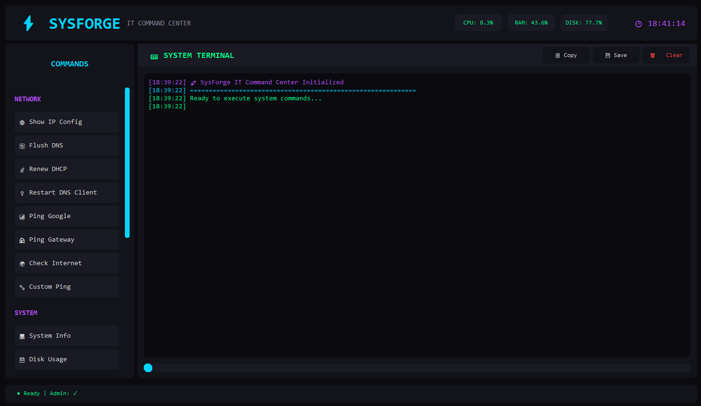

# ⚡ SysForge - IT Command Center



A cool Windows system administration tool built with Python and CustomTkinter.

## ✨ Features

### 🌐 Network Tools
- Show IP Configuration
- Flush DNS Cache
- Renew DHCP Lease
- Restart DNS Client
- Ping Google/Gateway
- Custom Ping Tool
- Internet Connectivity Check
- Network Adapter Reset

### 💻 System Tools
- System Information Viewer
- Disk Usage Analysis
- Disk Scan & Repair
- Temporary File Cleanup
- Empty Recycle Bin
- Group Policy Update
- Print Spooler Restart

### 🔧 Maintenance
- Full System Maintenance Mode
- Windows Defender Scan
- RAM Cleaner
- Startup Program Optimizer
- Real-time System Monitoring

### 🎨 Advanced Features
- Admin Privilege Auto-Request
- Live Terminal with Colored Output
- Animated Progress Bars
- Log Export to Text File
- Copy Logs to Clipboard
- Thread-Safe Command Execution
- Cyberpunk Dark Theme UI
- Live System Stats Display
- Real-time Clock

## 📦 Installation

### Prerequisites
- Windows 10/11
- Python 3.8+
- Administrator privileges (recommended)

### From Source
```bash
git clone https://github.com/MY7H1C26/SysForge.git
cd SysForge
pip install -r requirements.txt
python main.py